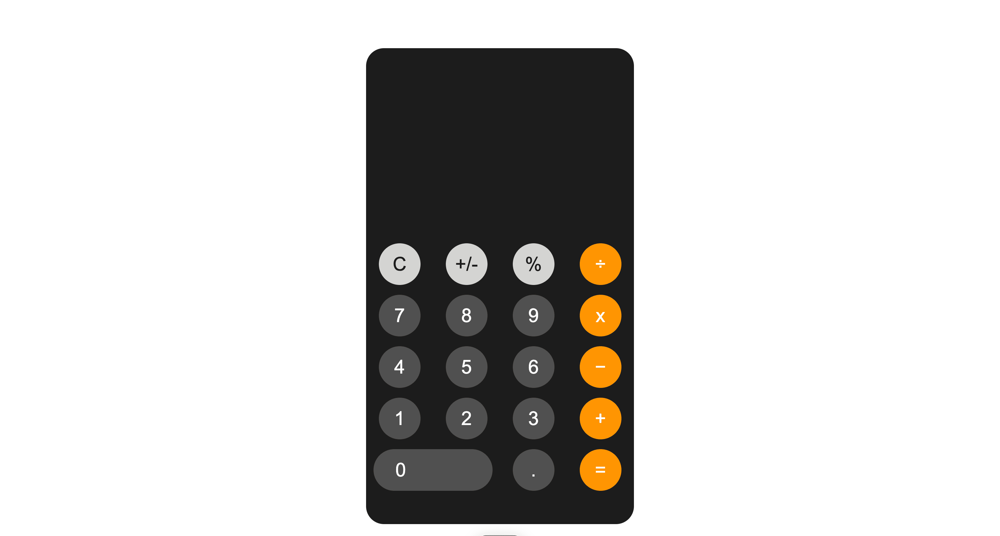

# Calculator App



A simple and intuitive calculator built with HTML, CSS, and JavaScript, which supports basic arithmetic operations and handles multiple operations with proper order of operations (PMDAS).


## Overview

This project provides a functional calculator with a modern UI. Users can perform addition, subtraction, multiplication, and division, with the app also respecting the order of operations (PMDAS). The user interface is styled with CSS, and JavaScript handles the logic of performing calculations and input handling.

## Features

- Perform basic arithmetic operations: `+`, `-`, `x`, `÷`
- Supports multiple operations in a single expression (PMDAS)
- Prevents division by zero errors
- Stylish and responsive user interface

## Installation

To set up the project, follow these steps:

1. Clone the repository:

    ```bash
    git clone https://github.com/YVictorin/calculator.git
    ```

2. Navigate to the project folder:

    ```bash
    cd calculator
    ```

3. Open the index.html file to start this project in your web browser.

## Usage Example

Once the project is set up, you can use the calculator by simply opening the `index.html` file in your browser. Here’s how the app works:

- Click on number buttons (`0-9`) to input numbers.
- Click on operator buttons (`+`, `-`, `x`, `÷`) to select an operation.
- Use the `=` button to calculate the result.
- Press `C` (AC button) to clear the display.

For example, clicking on the buttons `5`, `+`, `3`, and `=` will result in `8` displayed on the screen.


## Contributing

1. Fork it (<https://github.com/YVictorin/calculator/fork>)
2. Create your feature branch (`git checkout -b feature/fooBar`)
3. Commit your changes (`git commit -am 'Add some fooBar'`)
4. Push to the branch (`git push origin feature/fooBar`)
5. Create a new Pull Request
